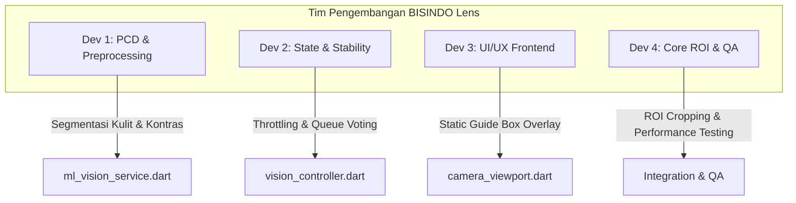

# Rencana Distribusi Tugas (Tupoksi) Tim Pengembangan Fitur BISINDO Lens

Dokumen ini membagi pengerjaan 4 fitur tambahan ke dalam **4 peran developer** yang terstruktur, lengkap dengan tanggung jawab utama (Tupoksi) dan panduan teknis langkah demi langkah (*step-by-step implementation guide*) demi menjaga kualitas kode (*clean code*).

---



---

## 👨‍💻 Developer 1: PCD & Preprocessing Specialist
> **Fokus Utama:** Fitur 1 (Perbaikan Kontras Gelap) & Fitur 4 (Pembeda Baju & Tangan dengan Segmentasi Kulit).

### 📋 Tupoksi:
1. Mengintegrasikan algoritme Pengolahan Citra Digital (PCD) dari `ImageProcessingUtils` ke dalam pipeline inferensi `MlVisionService`.
2. Membuat deteksi ambang batas gelap (*ambient light sensor simulation*) berbasis nilai rata-rata Luminansi (Y) pada frame kamera.
3. Menerapkan penapisan warna kulit (*skin segmentation masking*) untuk menghapus area non-kulit (baju/background) sebelum dikirim ke interpreter TFLite.

### 🛠️ Cara Pengerjaan:
1. **Langkah 1 (Deteksi Gelap & Perbaikan Kontras):**
   Buka file [ml_vision_service.dart](file:///home/thomas005/lib_modul_ai/lib/features/vision/services/ml_vision_service.dart) dan edit fungsi pemrosesan background isolate `_preprocessCamera`. Sebelum tahap normalisasi piksel, hitung rata-rata nilai Luminance (Y).
   ```dart
   // Hitung kecerahan rata-rata frame (Y-channel)
   double sumY = 0.0;
   for (int y = 0; y < targetH; y++) {
     for (int x = 0; x < targetW; x++) {
       final r = rgbMatrix[y][x][0];
       final g = rgbMatrix[y][x][1];
       final b = rgbMatrix[y][x][2];
       sumY += (0.299 * r) + (0.587 * g) + (0.114 * b);
     }
   }
   final double avgBrightness = sumY / (targetH * targetW);

   // Jika terdeteksi gelap (misal di bawah nilai 85)
   if (avgBrightness < 85.0) {
     ImageProcessingUtils.equalizeContrast(rgbMatrix, targetW, targetH);
   }
   ```
2. **Langkah 2 (Pemisahan Baju & Tangan):**
   Tepat setelah perbaikan kontras selesai dilakukan pada matriks gambar, jalankan segmentasi kulit agar baju dan latar belakang berubah menjadi hitam pekat:
   ```dart
   // Segmentasi kulit untuk menghilangkan baju dan latar belakang
   ImageProcessingUtils.applySkinSegmentation(rgbMatrix, targetW, targetH);
   ```

---

## 👨‍💻 Developer 2: State Management & Control Flow Engineer
> **Fokus Utama:** Fitur 2 (Pengurangan Kecepatan Real-time / Anti-Flicker & Stabilitas Prediksi).

### 📋 Tupoksi:
1. Mengatur kecepatan laju pemrosesan inferensi (*inference rate throttling*) agar sistem tidak terlalu terbebani dan lebih stabil.
2. Mengembangkan mekanisme stabilisasi prediksi menggunakan metode antrean (*Sliding Window Queue*) dengan pencarian kelas mayoritas (*majority voting*).
3. Melakukan sinkronisasi durasi verifikasi isyarat agar sinkron dengan laju deteksi baru.

### 🛠️ Cara Pengerjaan:
1. **Langkah 1 (Memperlambat Laju Real-time):**
   Buka file [vision_controller.dart](file:///home/thomas005/lib_modul_ai/lib/features/vision/vision_controller.dart) dan ubah kondisi throttling waktu inferensi pada fungsi `_startDetection`:
   ```dart
   // Ubah interval minimum dari 250ms menjadi 500ms atau 800ms
   if (isSwitchingModel || _mlService.isProcessing || now - _mlService.lastInferenceTime < 600) return;
   ```
2. **Langkah 2 (Implementasi Sliding Window):**
   Tambahkan variabel antrean hasil deteksi terakhir (misal berkapasitas 5 frame) ke dalam `VisionController`:
   ```dart
   final List<String> _predictionHistory = [];
   static const int _historyLimit = 5;

   void _updateDetections(List<BoundingBox> newDetections, {bool isCameraStream = false}) {
     if (isCameraStream && newDetections.isNotEmpty) {
       newDetections.sort((a, b) => b.confidence.compareTo(a.confidence));
       final top = newDetections.first;

       // Tambahkan prediksi ke riwayat antrean
       _predictionHistory.add(top.label);
       if (_predictionHistory.length > _historyLimit) {
         _predictionHistory.removeAt(0);
       }

       // Hitung prediksi mayoritas (Majority Voting)
       final String stabilizedLabel = _getMajorityLabel();
       
       // Gunakan stabilizedLabel untuk memproses verifikasi kata
       // (menggantikan top.label mentah agar tidak berkedip)
     }
   }

   String _getMajorityLabel() {
     if (_predictionHistory.isEmpty) return "";
     final Map<String, int> counts = {};
     for (var label in _predictionHistory) {
       counts[label] = (counts[label] ?? 0) + 1;
     }
     // Cari label dengan kemunculan terbanyak
     return counts.entries.reduce((a, b) => a.value > b.value ? a : b).key;
   }
   ```

---

## 👨‍💻 Developer 3: UI/UX & Graphics Painter Developer
> **Fokus Utama:** Fitur 3 (Pembuatan Desain Kotak Pembatas Panduan Statis / Static Guide Box).

### 📋 Tupoksi:
1. Mendesain dan membangun komponen kotak pembatas statik (*Static ROI Guide Box Overlay*) di tengah layar kamera pada halaman `CameraViewport`.
2. Menyediakan indikator visual yang intuitif (seperti animasi denyut halus / *breathing effect* atau perubahan warna sudut bingkai) ketika tangan terdeteksi berada di dalam kotak.
3. Mengatur agar kotak panduan statik ini bersifat responsif di berbagai ukuran perangkat.

### 🛠️ Cara Pengerjaan:
1. **Langkah 1 (Merancang UI Kotak Statis):**
   Buka file [camera_viewport.dart](file:///home/thomas005/lib_modul_ai/lib/features/vision/camera_viewport.dart) dan tambahkan widget kotak statis di dalam `_buildCameraSection()` Stack:
   ```dart
   Widget _buildCameraSection() {
     return Stack(
       fit: StackFit.expand,
       children: [
         if (_controller.isInitialized) CameraPreview(_controller.cameraController!),
         
         // Overlay Kotak Panduan Statik (Static Target Guide Box)
         Center(
           child: Container(
             width: 280,
             height: 280,
             decoration: BoxDecoration(
               border: Border.all(
                 color: _controller.detections.isNotEmpty ? Colors.greenAccent : const Color(0xFF06B6D4),
                 width: 3.0,
               ),
               borderRadius: BorderRadius.circular(16),
             ),
             child: const Align(
               alignment: Alignment.bottomCenter,
               child: Padding(
                 padding: EdgeInsets.all(8.0),
                 child: Text(
                   "Posisikan Tangan di Sini",
                   style: TextStyle(color: Colors.white70, fontSize: 12, fontWeight: FontWeight.bold),
                 ),
               ),
             ),
           ),
         ),
       ],
     );
   }
   ```
2. **Langkah 2 (Menyembunyikan Bounding Box Dinamis):**
   Komentari pemanggilan `BoundingBoxPainter` di dalam stack preview agar koordinat kotak mentah yang bergerak-gerak tidak digambar lagi di layar, sehingga UI tampak bersih dan fokus pada kotak statik.

---

## 👨‍💻 Developer 4: Core Engine Integration, ROI Crop & QA Engineer
> **Fokus Utama:** Fitur 3 (Penerapan ROI Cropping pada Core Preprocessing) & Pengujian Mutu (QA).

### 📋 Tupoksi:
1. Memodifikasi fungsi pemotongan koordinat gambar (*cropping*) di `_preprocessCamera` agar fokus memotong bagian citra yang berada di area koordinat kotak panduan statis saja.
2. Mengintegrasikan seluruh kode dari Developer 1, 2, dan 3 agar berjalan serasi tanpa terjadi kebocoran memori (*memory leak*).
3. Melakukan pengujian fungsionalitas (*QA Testing*) akurasi deteksi di lingkungan redup (gelap) dan menguji ketahanan model terhadap berbagai latar belakang warna pakaian.

### 🛠️ Cara Pengerjaan:
1. **Langkah 1 (Pemotongan ROI Gambar yang Dikirim ke Model):**
   Buka file [ml_vision_service.dart](file:///home/thomas005/lib_modul_ai/lib/features/vision/services/ml_vision_service.dart). Modifikasi variabel koordinat awal pemotongan (`cropStartX` dan `cropStartY`) di dalam fungsi `_preprocessCamera` agar tidak mengambil area tengah 1:1 global, melainkan mengambil piksel yang berada di dalam proporsi koordinat kotak statis 280x280 yang telah diletakkan oleh Developer 3 di tengah viewport.
   ```dart
   // Mengubah titik awal crop agar tepat berada di area panduan statis 
   final int cropSize = (srcW < srcH ? srcW : srcH) ~/ 1.5; // Batasi ukuran fokus ROI
   final int cropStartX = (srcW - cropSize) ~/ 2;
   final int cropStartY = (srcH - cropSize) ~/ 2;
   ```
2. **Langkah 2 (Pengujian Performa & Stabilitas):**
   - Lakukan uji beban (*stress testing*) dengan memantau FPS aplikasi setelah penambahan fungsi `equalizeContrast` dan `applySkinSegmentation`.
   - Pastikan pemrosesan PCD berjalan lancar di dalam `Isolate.run` (latensi tetap di bawah 30ms) agar antarmuka aplikasi tidak tersendat (*lagging*).

---

> [!NOTE]
> Pembagian tugas ini dirancang agar setiap developer dapat bekerja secara paralel pada berkas terpisah, meminimalisasi konflik saat penggabungan kode (*git merge*), dan menjamin implementasi mengikuti kaidah penulisan kode bersih (*Clean Code principles*).
